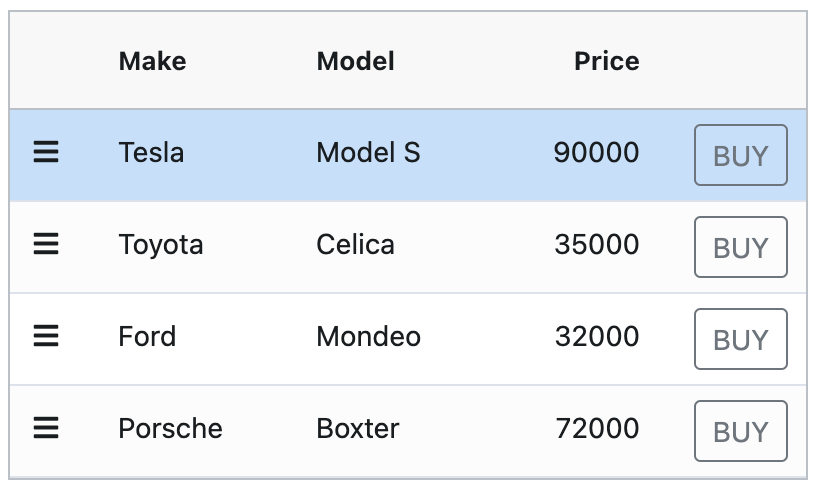

# ag-Grid Example

An example showing ag-Grid tips and tricks.



1. The first column renders a hamburger icon which opens the ag-Grid context
   menu when clicked. The default behavior of opening the context menu by right
   clicking on a cell is suppressed using the `suppressMenu` option.
2. The last column renders a button which displays an alert when clicked. In
   this case, we attach an `onClick` handler to the real DOM element to prevent
   row selection when the buy button is clicked.

## Getting Started

Execute the following commands to build and run the application.

```bash
$ yarn
$ yarn start
```

Now point your browser to http://localhost:3000/.
